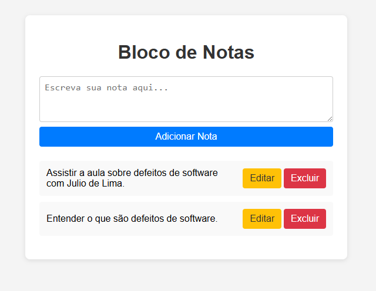

# Bloco de Notas Simples (Frontend)

Esta aplicação web simula um bloco de notas, permitindo ao usuário adicionar, editar e excluir notas diretamente no navegador, sem backend. O objetivo é servir como material didático para demonstrar como defeitos de software podem surgir em aplicações simples.

## Objetivo

- Ensinar alunos sobre como defeitos acontecem em software, mesmo em sistemas simples.
- Simular uma tela de bloco de notas, onde o usuário pode escrever lembretes para si mesmo.
- Permitir inclusão, alteração e exclusão de notas (CRUD básico, apenas frontend).

## Como funciona

- A aplicação é composta apenas por HTML, CSS e JavaScript.
- Todas as notas são armazenadas em memória (array JavaScript), sem persistência.
- O usuário pode adicionar uma nova nota, editar uma existente ou excluí-la.

## Problema Crítico (Defeito Demonstrativo)

> **Atenção:** Existe um defeito crítico proposital na funcionalidade de exclusão de notas.
>
> Ao excluir uma nota, pode ocorrer um comportamento inesperado, como exclusão incorreta ou falha na atualização da lista. Este defeito foi mantido intencionalmente para ser utilizado como exemplo didático em sala de aula.

## Screenshots

Veja abaixo uma captura de tela da aplicação:

## Contexto Didático

Este projeto foi desenvolvido para a aula sobre defeitos de software ministrada por Julio de Lima. O objetivo é mostrar, na prática, como defeitos podem surgir e como identificá-los/testá-los.

Assista à aula completa aqui: [https://youtu.be/xXBez5yhn9U?si=PZLc5HTApFGE8Mz8](https://youtu.be/xXBez5yhn9U?si=PZLc5HTApFGE8Mz8)

## Como Executar a Aplicação

1. Clique no botão verde "Code" e depois em "Download ZIP".
2. Após o download, localize o arquivo ZIP na sua pasta de downloads e extraia o conteúdo (clique com o botão direito e escolha "Extrair tudo").
3. Abra a pasta extraída (ela se chama `aula-02`).
4. Procure pelo arquivo chamado `index.html` dentro dessa pasta.
5. Clique duas vezes no arquivo `index.html`.
6. O navegador de internet (como Chrome, Edge ou Firefox) será aberto automaticamente mostrando a tela do bloco de notas.
7. Agora você pode adicionar, editar e excluir notas diretamente na página.

Pronto! Não é necessário instalar nada ou ter conhecimentos técnicos. Basta abrir o arquivo e usar.

---

**Desenvolvido para fins educacionais.**